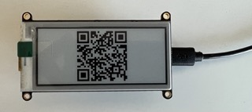

# ESP32 Spotify now playing

This repo fetches the currently playing track from your Spotify account, and shows it on an e-ink display.

Clients authenticate via OAuth.

## Flow

### 1 - Start screen with QR code to log in

Scan QR code with a phone to visit the webserver on the ESP for authentication.

Note: phone must be connected to the same WiFi network as the ESP32.

### 2 - Log in on Spotify

The ESP redirects to an OAuth login flow on Spotify.

### 3 - ESP shows currently playing track on Spotify

The ESP will show a different screen, with track info of the track you're currently playing on Spotify.

Track will auto-update every few seconds.

To log in as a different user, scan the QR code on the right side of the screen to restart the OAuth flow.

## Develop

1. Download the [pio](https://platformio.org/) CLI.
2. Create `Credentials.h` file, by `mv src/Credentials_example.txt src/Credentials.h` and filling out the values.
3. Plug in ESP32, find its path with `pio list`
4. Build & run code with `pio run --upload-port /dev/ttyUSB0 --monitor-port /dev/ttyUSB0 --target upload --target monitor` (using path from previous step)

## Hardware

If you use different versions, you may need to change pin mappings.

- `Adafruit HUZZAH32 – ESP32 Feather Board` ([link](https://www.adafruit.com/product/3405))
- `Adafruit 2.9" Grayscale eInk / ePaper Display FeatherWing - 4 Level Grayscale` ([link](https://www.adafruit.com/product/4777))
